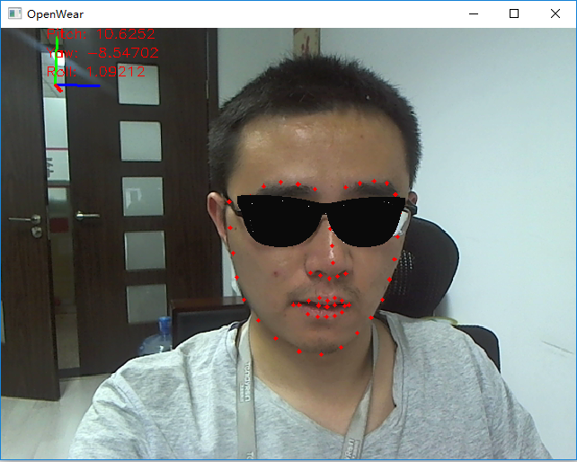

# OpenWear

### 基于sdm的虚拟眼镜试戴

    

实现了如下功能：
* 1.将OpenCV获取的Mat格式数据通过纹理贴图的方式绘制到OpenGL窗口上
* 2.使用sdm检测和跟踪人脸的68个关键点
* 3.加载3D眼镜模型
* 4.渲染的眼镜随人脸的移动而移动，随人脸的远近而缩放，随人脸的旋转而旋转

## 模型资源下载
将[release](https://github.com/imistyrain/OpenWear/releases/tag/1.0)里所有的文件放至[OpenWear/model](OpenWear/model)下

## Windows

* 1.按照[MRHead工程](https://github.com/imistyrain/MRHead)配置OpenCV编译链接环境
* 2.下载[OpenGL的头文件和库文件](https://pan.baidu.com/s/1pLtzn55)，密码：37gp
把include文件夹路径加入到VC的头文件包含路径中，lib加到库文件包含路径中，bin里面的dll考到C:/Windows/System32/文件夹下
* 3.打开VS2015编译即可

## Ubuntu & Mac

./run.sh